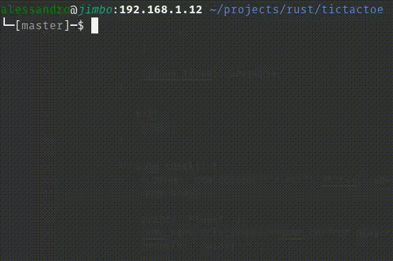

# TUI TicTacToe in Rust
A simple [TUI](https://en.wikipedia.org/wiki/Text-based_user_interface) TicTacToe game written in Rust.



As this is my first Rust project, I'm sure there are many things that can be improved.
If you have any suggestions, feel free to open an issue or a pull request.

## Installation and Usage
You need to have [Rust](https://www.rust-lang.org/) installed on your system.

```bash
cargo run
```

Easy as that!

## License
This project is licensed under the GPL-3.0 License - see the [LICENSE](LICENSE) file for details.